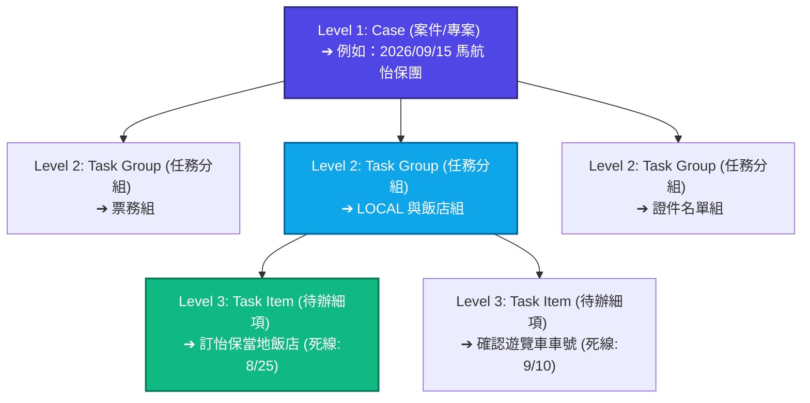

# 📖 CaseFlow OS 員工操作手冊 (Employee Handbook)

歡迎來到 **CaseFlow OS**！本手冊旨在幫助新進夥伴、實習生與工讀生在「第一天第一小時」就能光速上手。這套系統是我們團隊高效協作的秘密武器，請務必詳細閱讀以下指南。

> 🛠️ **技術與架構規格 (Phase 2 Checkpoint)**
> 本系統採用 **FastAPI** 作為後端核心 API 框架，底層使用 **SQLite** 與 **SQLAlchemy** 進行高效資料讀寫與關聯設計。前端架構採用 **Tailwind CSS**，並深度整合 **FullCalendar v6** (日曆模式) 與 **Frappe Gantt** (甘特圖模式)，提供流暢且現代化的單頁應用 (SPA) 互動體驗。

---

## 🌟 1. 歡迎來到 CaseFlow OS（核心精神）

### 💡 為什麼我們不用傳統的 LINE 群組或流水帳記事本？
* **LINE 群組的痛點**：訊息洗版快、文件會過期、已讀不代表已做、誰負責什麼事情完全搞不清楚，常常「漏球」導致被客戶或合作夥伴投訴。
* **流水帳記事本的痛點**：缺乏結構，無法一眼看出事情的緊急程度，更無法針對特定小任務進行討論。

**CaseFlow OS** 就是為了解決這些問題而生的！它將所有專案、任務和溝通整合在同一個平台，並遵循以下三大鐵律：

| 鐵律名稱 | 核心精神 | 具體表現 |
| :--- | :--- | :--- |
| **1. 不漏球 (Zero-Miss)** | 凡事有交代，件件有落地。 | 每個待辦細項都有明確的 **Dead Line（截止日）** 與自動提醒，絕對不遺漏任何小細節。 |
| **2. 責任明確 (Clarity)** | 誰能看、誰負責、誰在等，一目了然。 | 任務狀態透明。誰負責該任務、哪些人有權限查看、目前卡在誰身上，卡關時能直接定位，不推諉。 |
| **3. 視圖自由 (Flexibility)** | 不同角色，看他最需要的畫面。 | 早上用 **日曆** 抓今天死線，下午用 **樹狀案件** 處理工作細節，主管用 **甘特圖** 掌控整體進度。 |

---

## 🧱 2. 系統 3 層結構概念（3分鐘搞懂）

在 CaseFlow OS 中，所有的工作都是由一個簡單的「三層金字塔結構」組成的：

* **Level 1: Case (案件/專案)**
  * **解釋**：這是一整個獨立的大專案、出團行程或活動。
  * **範例**：`2026/09/15 馬航怡保團`、`公司年度春酒`、`2026 台北國際旅展攤位規畫`。
* **Level 2: Task Group (任務分組)**
  * **解釋**：同一個 Case 之下，依據職能或性質分出來的工作大類別。
  * **範例**：在馬航怡保團下，分為 `票務組`、`LOCAL 與飯店組`、`證件名單組`。
* **Level 3: Task Item (待辦細項) [最重要！]**
  * **解釋**：真正需要被執行的具體動作，也是工讀生和團員每天要消滅的 To-Do。
  * **功能**：每個 Task Item 都可以設定：
    * **到期日（Due Date）**
    * **獨立備註**（存放訂購代號、連絡人電話等資訊）
    * **提醒時間**
    * **可見人員指派**
    * **留言討論區**（直接針對這個任務留言，不用在群組裡問「那件事好了沒」）

---

## 🖥️ 3. 3 大檢視模式操作指南（工讀生每日必看）

系統提供三種視角，應對不同的日常工作場景：

### 📅 模式 A. 日曆模式 (Calendar View)
> **「每天早上進公司第一件事：打開日曆模式，看紅黃綠燈！」**

這是你的「今日行動指南」，請根據燈號顏色決定工作的優先順序：

* 🔴 **紅色燈號：已過期且未完成**
  * **意思**：這件事情已經超過死線了！
  * **動作**：**請立刻處理！** 若有困難，主動回報主管，切勿放任紅色燈號亮著。
* 🟡 **黃色燈號：今天或 48 小時內即將到期**
  * **意思**：這是你今天必須消滅的「今日任務」。
  * **動作**：合理分配今日時間，確保在下班前將其完成或推進。
* 🟢 **綠色燈號：已完成**
  * **意思**：太棒了！此任務已安全落地。

---

### 📋 模式 B. 案件樹狀模式 (Case Tree View)
> **「在這裡，你可以展開專案、填寫資訊、並與同事進行精準溝通。」**

#### 1. 展開與檢視
點擊 Case 左側的 `▸` 箭頭展開任務分組（Task Group），再展開即可看到所有細項（Task Item）。

#### 2. 新增與編輯
* 點擊 Task Group 旁的 `+ 新增事項` 可以快速在該組別下建立新的待辦細項。
* 在 Task Item 下方的 **「備註欄」** 填寫關鍵資訊，例如：`飯店確認信已收到，確認號：#12345`。

#### 3. 項目級精準留言（避免洗版）
當你要詢問某個任務的進度或回報問題時：
1. 點開該 Task Item 的留言板。
2. 使用 **`@同事名字`** 進行留言。例如：`@小明 飯店確認信已上傳，請幫忙複查。`
3. 這樣一來，只有被 `@` 的人與該任務的關係人會收到通知，其他同事的視窗不會被無關訊息轟炸！

---

### 📊 模式 C. 甘特圖模式 (Gantt View)
> **「這是主管與專案負責人的全局地圖，用來看時間跨度與進度百分比。」**

* **橫軸**：時間軸（日期、星期）。
* **縱軸**：各個 Case 與 Task Group 的時間條。
* **長條圖長度**：代表該任務的起迄時間（例如票務作業從 8/1 一直持續到 8/15）。
* **進度條 (%)**：每個時間條內會有深色區域代表已完成的百分比，例如 `票務組 [已完成 60%]`，主管一眼就能看出進度是否落後。

---

## 🔒 4. 權限與可見度說明（避免洩密與資訊過載）

為了保護客戶隱私、商業機密，並避免給夥伴帶來無關的資訊干擾，我們實施了**嚴格的任務級權限控制**：

* **誰能看見？**
  * 每個 Task Item 建立時，都可以手動勾選 **「可見人員」**（例如：指派給主管 A 與工讀生 B）。
* **沒被勾選的人會怎樣？**
  * 沒有被勾選的成員，在他們的日曆、樹狀圖、甘特圖中，**完全不會看到這個 Task Item**，也無法進入其留言區。
  * 這樣可以確保每個人只專注於自己負責的工作，版面清爽，資訊不超載！

---

## 🚀 5. 未來展望預告（Templates 一鍵導入）

為了進一步解放大家的雙手，系統即將上線 **「出團標準範本庫」** 功能！

未來只要接到新案子（例如新增一團馬來西亞怡保團），負責人只需要：
1. 選擇範本 `[東南亞出團標準範本]`。
2. 輸入 **出發日期**（例如：`2026/10/10`）。
3. 系統將會**自動回推並一鍵生成**所有標準任務的死線！
   * *出發前 45 天*：自動生成 `【票務組】收取訂金與開票確認`
   * *出發前 30 天*：自動生成 `【證件名單組】收集護照影本與辦理簽證`
   * *出發前 7 天*：自動生成 `【LOCAL組】確認當地導遊聯絡方式與車牌`

大家再也不用手動計算死線，敬請期待！

---

> 💡 **小貼士**：本手冊將隨系統升級持續更新。若在操作過程中發現任何 Bug 或有更好用的功能提案，歡迎隨時向系統管理團隊反映！

---

## 🛠️ 開發日誌 (Development Log)

### 📅 2026-08-17 - 核心 MVP 基礎建設與三視圖實作
- **專案骨架與環境搭建**：初始化 Git 儲存庫並配置 Python 3.12 虛擬環境 (`.venv`) 與 `requirements.txt`。
- **資料庫與 ORM 模型設計**：建置 `database.py` 及定義 `User`、`Case`、`TaskGroup`、`TaskItem`、`TaskComment` 及權限關聯表。
- **資料過濾與安全查詢 (CRUD)**：實作 `get_user_cases` 查詢，確保未授權成員無法讀取特定任務、備註與留言，避免資訊洩漏與超載。
- **示範資料生成器 (Seed)**：實作 `seed.py` 自動建立專案管理員 (Martin)、作業 (OP_Ning)、銷售 (Sales_Yang)、實習生 (Intern_A) 角色，並自動寫入包含 3 大任務分組與 4 項待辦細項的怡保專案出團示範資料。
- **全視圖儀表板與 API 串接**：完成 [index.html](file:///d:/Projects/CaseFlow_OS/templates/index.html) 的實作，整合 FullCalendar v6 與 Frappe Gantt，並透過網頁頂端「使用者切換下拉選單」動態刷新 API，達成無縫權限展示與任務狀態勾選更新。
